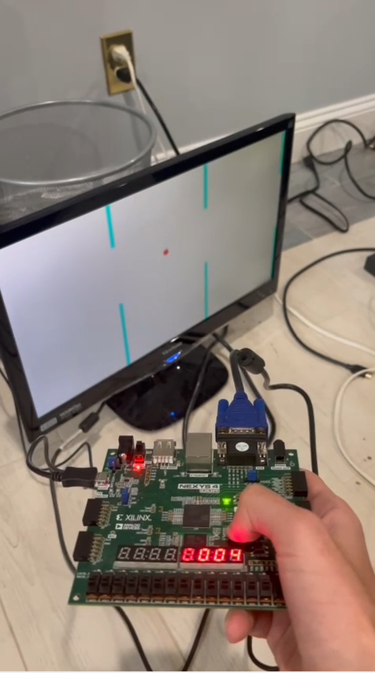

## Expected behavior and attachments needed

## Summary 

## Description of inputs

## Images and/or videos

## Conclude 

## 1. Create a new RTL project pong in Vivado Quick Start
Create six new source files of file type VHDL called clk_wiz_0, clk_wiz_0_clk_wiz, vga_sync, bat_n_ball, adc_if, and pong

clk_wiz_0.vhd and clk_wiz_0_clk_wiz.vhd are the same files as in Lab 3

vga_sync.vhd, bat_n_ball.vhd, adc_if.vhd, and pong.vhd are new files for Lab 6

Create a new constraint file of file type XDC called pong

Choose Nexys A7-100T board for the project

Click 'Finish'

Click design sources and copy the VHDL code from clk_wiz_0, clk_wiz_0_clk_wiz, vga_sync.vhd, bat_n_ball.vhd, adc_if.vhd, pong.vhd (or pong_2.vhd)

Click constraints and copy the code from pong.xdc (or pong_2.xdc)

As an alternative, you can instead download files from Github and import them into your project when creating the project. The source file or files would still be imported during the Source step, and the constraint file or files would still be imported during the Constraints step.

## 2. Run synthesis
## 3. Run implementation
3b. (optional, generally not recommended as it is difficult to extract information from and can cause Vivado shutdown) Open implemented design
## 4. Generate bitstream, open hardware manager, and program device
Click 'Generate Bitstream'

Click 'Open Hardware Manager' and click 'Open Target' then 'Auto Connect'

Click 'Program Device' then xc7a100t_0 to download pong.bit to the Nexys A7-100T board

## Modifications (Lab6)

## Video

